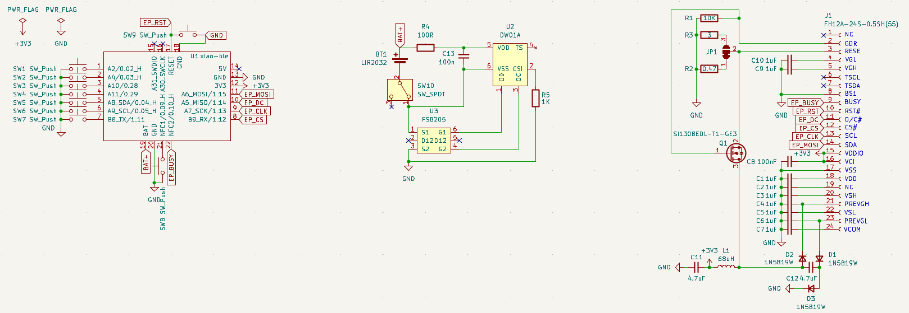
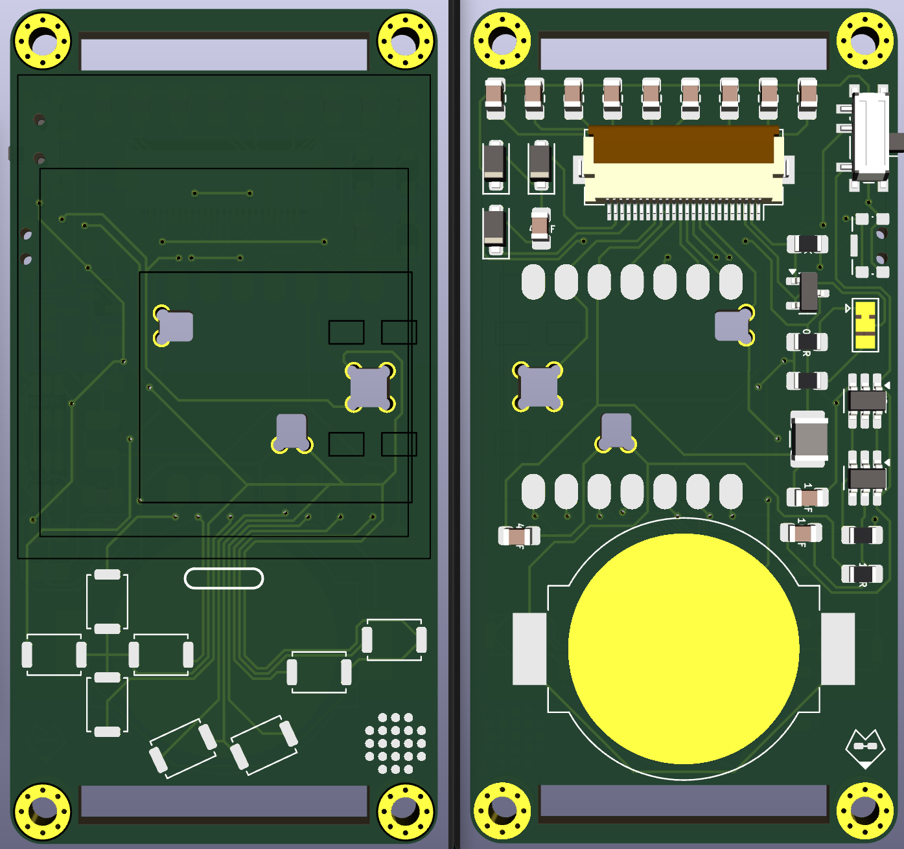

# EPD Boy (2025)

A work in progress ePaper laynard charm.

## Preview

## References

Good Display: https://www.good-display.com/product/388.html

E-Ink Adapter: https://hackaday.io/project/164772-e-ink-adapter

Universal ePaper Display: https://www.pcbway.com/project/shareproject/Universal_E_Paper_adapter_PCB_9b9a845c.html

ZMK Design Guide (BMS Circuit Protection): https://github.com/ebastler/zmk-designguide?tab=readme-ov-file#additional-battery-management-considerations

BMS Footprints: https://github.com/ebastler/marbastlib